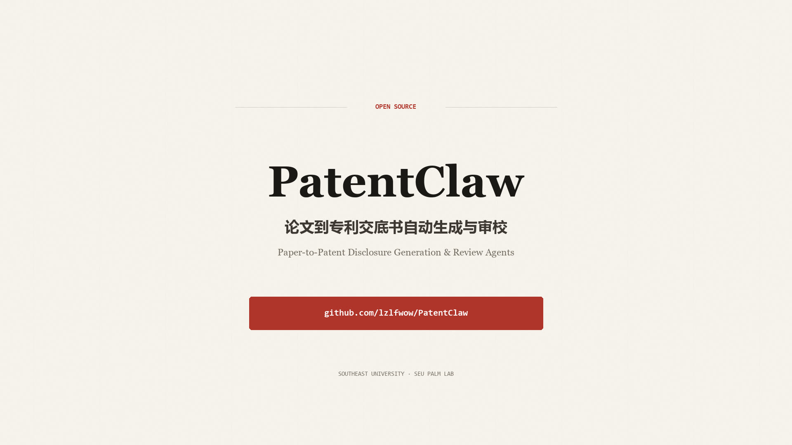

# PatentClaw v0.1

> 基于科研论文Latex文档直接生成发明专利技术交底书（中国），并通过固定检查表完成审查与多轮改稿。

[](https://www.python.org/)
[](LICENSE)
[](#项目状态)
[](https://lzlfwow.github.io/PatentClaw/)

[在线展示](https://lzlfwow.github.io/PatentClaw/) ·
[真实运行示例](https://lzlfwow.github.io/PatentClaw/example.html) ·
[PatentGenerator 文档](PatentGenerator/README.md) ·
[PatentReviewer 文档](PatentReviewer/README.md)



PatentClaw 面向希望把论文技术成果整理为专利材料的科研人员。系统保留论文证据，先将
研究叙述转换为技术问题、技术方案、实施方式和有益效果，再依据中国发明专利技术交底
书要求逐项检查，输出修改意见、修改记录和最终版交底书。

当前仓库为第一版原型（`v0.1`）。生成和审查结果用于辅助发明人及专利代理师整理
材料，不构成新颖性、创造性、授权概率、侵权判断或法律意见。

如有商业合作意向请联系tangkaihua@tongji.edu.cn或xuyang_palm@seu.edu.cn

## 核心能力

- **多 Agent 论文理解与成稿**：五个正文 Agent 分别负责论文理解、发明挖掘、技术
  方案、实施例与证据、交底书撰写。
- **证据可追溯**：解析 LaTeX 章节、公式、表格、算法和图注，建立证据编号及字段
  映射，减少无依据扩写。
- **中国专利固定检查表**：Reviewer 使用30项版本化检查项，覆盖13个维度；其中18项
  为确定性规则，12项为在线语义检查。
- **逐问题独立改稿**：每个未通过的 `check_id` 由单独的问题 Agent 处理，只能提交
  对应字段的局部补丁，不能顺便改动其他内容。
- **多轮审查闭环**：改稿后重新执行完整检查表，直到全部通过、没有安全修改，或达到
  配置的轮数上限。
- **结构化产物**：Generator 和 Reviewer 均输出 JSON、Markdown、DOCX，同时保留
  初审、终审、证据、逐项改稿和修改前后对比。
- **离线与在线模式**：离线模式用于验证解析、规则和数据流；在线模式通过 OpenAI
  兼容 Responses API 完成结构化语义生成、审查和改稿。

## 系统架构

PatentGenerator 与 PatentReviewer 是两个独立 Python 包，通过 `job.json` 文件契约
协作，不直接依赖彼此的内部模块。

```text
LaTeX / LaTeX ZIP
        │
        ▼
┌──────────────────────────────────────────────┐
│ PatentGenerator                              │
│ 解析与证据账本                               │
│   → Paper Understanding Agent                │
│   → Invention Mining Agent                   │
│   → Technical Solution Agent                 │
│   → Embodiment & Evidence Agent              │
│   → Disclosure Writer Agent                  │
└──────────────────────┬───────────────────────┘
                       │ job.json + 初稿 + 证据
                       ▼
┌──────────────────────────────────────────────┐
│ PatentReviewer                               │
│ 18项规则检查 + 12项在线语义检查              │
│   → 每个未通过项独立改稿                     │
│   → 局部补丁合并                             │
│   → 完整复审与多轮追修                       │
└──────────────────────┬───────────────────────┘
                       │
                       ▼
     最终交底书 + 初终审报告 + 变更记录
```

Reviewer 不会为了提高分数编造论文未披露的参数、步骤或实验结果。缺少原始事实时，
对应问题会标记为阻塞，并输出需要发明人补充的材料。

## 目录结构

```text
PatentClaw/
├── PatentGenerator/      # LaTeX论文解析、证据构建和技术交底书初稿生成
├── PatentReviewer/       # 固定检查表审查、逐问题多轮改稿和终审
├── web/                  # GitHub Pages展示页、演示视频和真实运行示例
├── .github/workflows/    # GitHub Pages自动部署
├── LICENSE
└── README.md
```

各模块的完整配置、API 和数据契约请分别查看
[PatentGenerator/README.md](PatentGenerator/README.md) 与
[PatentReviewer/README.md](PatentReviewer/README.md)。

## 快速开始

### 1. 安装

要求 Python 3.10 或更高版本。建议在同一虚拟环境中以开发模式安装两个包：

```bash
git clone https://github.com/lzlfwow/PatentClaw.git
cd PatentClaw

python -m venv .venv
source .venv/bin/activate

python -m pip install -e './PatentGenerator[dev]'
python -m pip install -e './PatentReviewer[dev]'
```

Windows PowerShell 激活命令为：

```powershell
.venv\Scripts\Activate.ps1
```

### 2. 生成技术交底书初稿

离线模式只验证解析、Agent 接口和导出结构：

```bash
cd PatentGenerator
export L2D_OFFLINE_MODE=true
latex2disclosure examples/sample.tex
```

正式在线生成需要配置支持 Responses API 和结构化输出的模型端点：

```bash
export L2D_OFFLINE_MODE=false
export OPENAI_API_KEY='your-api-key'
export OPENAI_BASE_URL='https://api.openai.com/v1'
export L2D_MODEL='your-model'
export L2D_REVIEW_MODEL='your-review-model'

latex2disclosure /path/to/paper.tex
# 或：latex2disclosure /path/to/latex-project.zip
```

任务完成后，Generator 在 `PatentGenerator/data/l2d-<id>/artifacts/` 下生成：

```text
job.json
technical_disclosure.md
technical_disclosure.docx
```

### 3. 审查并生成最终版

Reviewer 同时读取 Generator 的 `job.json` 和原始 LaTeX 材料：

```bash
cd ../PatentReviewer

export PR_OPENAI_API_KEY='your-api-key'
export PR_OPENAI_BASE_URL='https://api.openai.com/v1'
export PR_OPENAI_MODEL='your-model'
export PR_MAX_REVISION_ROUNDS=3

patent-reviewer run \
  --generator-job ../PatentGenerator/data/l2d-<id>/artifacts/job.json \
  --source /path/to/paper.tex \
  --output ./data \
  --online
```

Reviewer 在 `PatentReviewer/data/review-<id>/artifacts/` 下输出：

```text
initial_review.json / .md     # 初审结果与固定检查表状态
revision_plan.json            # 修订计划
revision_attempts.json        # 每轮、每个问题Agent的修改或阻塞结论
change_log.json               # 局部修改前后内容及关联问题
final_disclosure.json / .md / .docx
final_review.json / .md       # 终审结果
job.json                      # 完整任务快照
```

### 4. 运行测试

```bash
python -m pytest -q PatentGenerator/tests
python -m pytest -q PatentReviewer/tests
```

## HTTP API

两个模块也可以作为独立 FastAPI 服务运行。

```bash
# Generator，默认 http://127.0.0.1:8100
latex2disclosure-api

# Reviewer，默认 http://127.0.0.1:8011
patent-reviewer-api
```

Generator 提供任务上传、状态轮询和产物下载接口；Reviewer 提供审查任务接口。当前
版本适合单机原型，尚未集成统一的任务队列、账户权限、数据库和对象存储。

## 当前输入支持

| 模块 | 当前支持 | 尚未支持 |
| --- | --- | --- |
| PatentGenerator | 单个 `.tex`、LaTeX工程目录、LaTeX `.zip` | Word、PDF论文直接输入 |
| PatentReviewer | Generator `job.json` + `.tex`、目录或LaTeX `.zip` | Word、PDF原文直接输入 |
| Web | 静态功能展示、演示视频、真实运行示例 | 在线上传并执行Agent的完整工作台 |

不要通过修改扩展名的方式把 Word/PDF 当作 LaTeX 输入。论文中的 PDF/PNG/JPG 图像
资源可以被 LaTeX 解析器识别并用于现有文档导出，但当前版本不会把论文图自动重绘为
符合专利表达习惯的新附图。

## 项目状态

当前为第一版原型（`v0.1`），已完成：

- [x] LaTeX论文解析和证据账本
- [x] 多 Agent 技术交底书初稿生成
- [x] JSON、Markdown、DOCX 导出
- [x] 面向中国发明专利交底书的30项固定检查表
- [x] 按问题隔离的多轮审查与局部改稿
- [x] 初审、终审、逐项改稿和变更记录
- [x] FastAPI 接口及静态展示页

后续计划：

- [ ] **根据论文内容生成专用于专利申请的附图**：从论文的算法、系统结构、数据流和
  实验流程中提炼专利附图，而不是直接复用论文插图。
- [ ] 建立“论文证据—技术特征—附图节点/连线—正文引用”的可追溯映射。
- [ ] 支持流程图、系统框图、模块连接图和关键步骤示意图，并统一专利附图编号、标记
  和黑白线稿风格。
- [ ] 对生成附图执行节点完整性、连线一致性、正文引用和证据支持检查。
- [ ] 接入 Word/PDF 论文与交底书输入。
- [ ] 建设可上传、运行、查看证据和人工确认问题的统一 Web 工作台。
- [ ] 引入持久化任务队列、数据库、对象存储、身份认证和调用成本控制。

## 使用边界

- 模型不得补造原始材料未公开的技术事实；材料不足的问题需要发明人确认。
- 评分用于定位交底书材料风险，不代表专利授权概率。
- 当前系统不替代专利代理师的检索、权利要求撰写和法律审阅。
- 提交专利申请前，应由发明人核对事实、参数、附图和实施方式，并由专业人员复核。
- API 密钥只应放在环境变量或被 Git 忽略的 `.env` 中，不要提交到仓库。

## Web 展示

`web/` 是纯静态展示站点，由 GitHub Actions 发布到 GitHub Pages：

- 项目首页：<https://lzlfwow.github.io/PatentClaw/>
- 真实运行示例：<https://lzlfwow.github.io/PatentClaw/example.html>

本地预览：

```bash
python -m http.server 8000 --directory web
```

然后访问 <http://127.0.0.1:8000/>。

## License

本项目采用 [MIT License](LICENSE)。
